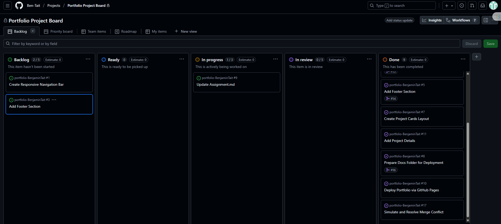
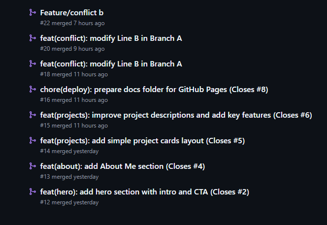
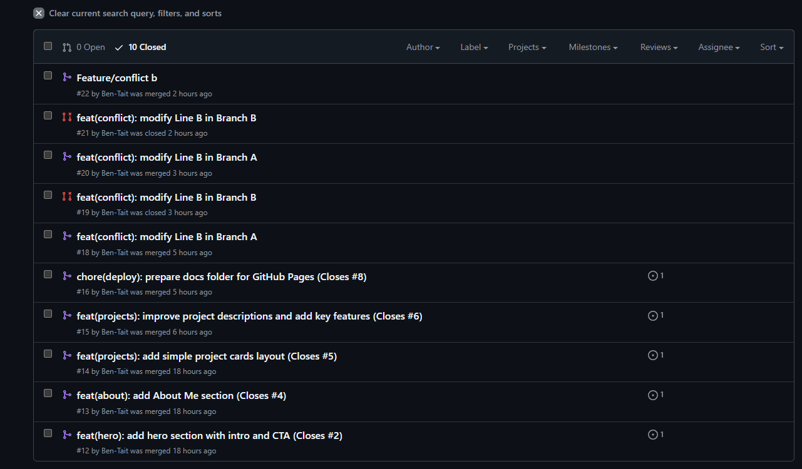
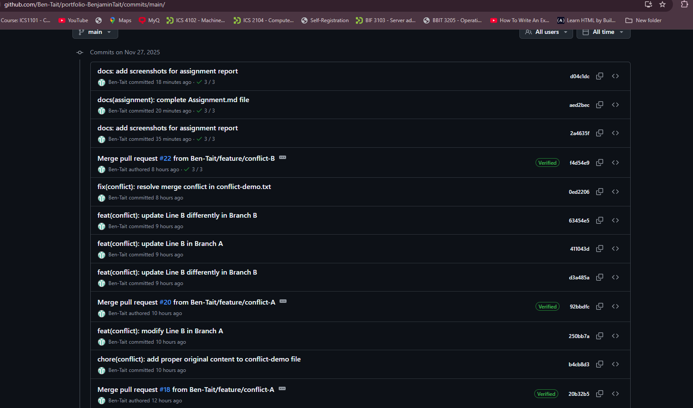
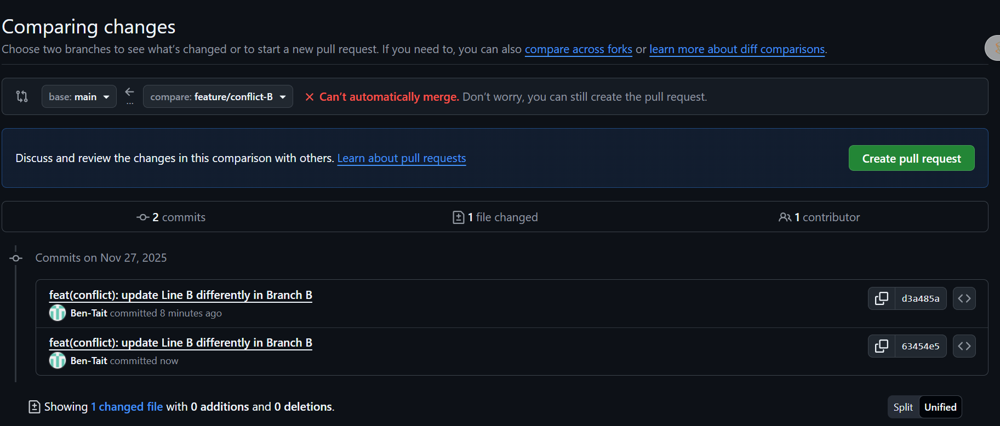
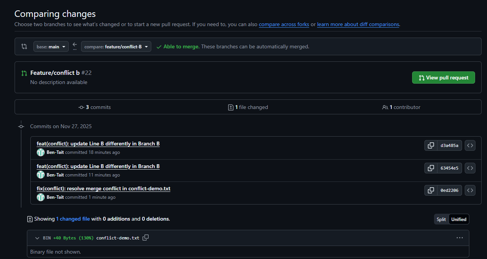

# Personal Portfolio Documentation

## 1. Student Details

**Full Name:** Benjamin Tait  
**Admission Number:** 150250  
**GitHub Username:** Ben-Tait  

**Portfolio Repository:**  
https://github.com/Ben-Tait/portfolio-BenjaminTait

**Deployed Live Site:**  
https://ben-tait.github.io/portfolio-BenjaminTait/

---

## 2. Project Overview

This project is a **Personal Portfolio Website** built using HTML, CSS, and JavaScript, managed end-to-end using GitHub best practices.

### Key Learning Objectives

- Using milestones, issues, and a project board
- Creating and working with feature branches
- Writing conventional commits
- Using Pull Requests and code reviews
- Simulating and resolving a merge conflict
- Deploying the final solution using GitHub Pages

---

## 3. Milestones & Issues

I organized the work into milestones that represented major parts of the portfolio:

- Landing Page Structure
- About Me Section
- Projects Section
- Deployment & Documentation
- Merge Conflict Simulation

Each milestone contained several GitHub issues.


---

## 4. GitHub Project Board

I used a Kanban-style project board with the columns:

- **To Do**
- **In Progress**
- **Done**

Every issue was moved across the board as progress was made.



---

## 5. Git Workflow

### A. Branching

Every issue had its own feature branch using the required naming format:

```
feature/<issue-number>-description
```

**Examples:**
- `feature/2-hero-section`
- `feature/4-about-me`
- `feature/6-project-details`



### B. Pull Requests

Each feature branch had a PR opened, linked to its respective issue, reviewed (self-review), and merged.



### C. Commit Conventions

I used **Conventional Commits**, including at least 6 types:

- `feat:` new features
- `fix:` bug fixes
- `docs:` documentation
- `style:` formatting
- `chore:` non-code tasks
- `refactor:` code restructuring

**Examples used:**
- `feat(hero): add hero section layout`
- `fix(conflict): resolve merge conflict in conflict-demo.txt`
- `docs(assignment): update Assignment.md`



---

## 6. Merge Conflict Simulation

This was a required part of the assignment. I intentionally caused a merge conflict using two branches:

- `feature/conflict-A`
- `feature/conflict-B`

Both branches edited the same line in `conflict-demo.txt` differently.

### Workflow Summary

1. Created `conflict-demo.txt`
2. Committed different changes in both branches
3. Merged `conflict-A` into `main` successfully
4. Opened PR for `conflict-B` → GitHub detected a conflict
5. Pulled `main` into branch B:
   ```bash
   git pull origin main
   ```
6. VS Code highlighted the conflict
7. Resolved the conflict manually
8. Committed the fix:
   ```bash
   fix(conflict): resolve merge conflict in conflict-demo.txt
   ```
9. Pushed and merged the PR successfully

### Screenshots





---

## 7. Deployment

Deployment was done with **GitHub Pages**.

### Steps

1. Added all website files inside the `docs/` folder
2. Committed and pushed to `main`
3. Enabled GitHub Pages under:  
   **Settings → Pages → Source → main /docs**

### Live Site

https://ben-tait.github.io/portfolio-BenjaminTait/

---

## 8. Final Checklist

| Requirement | Status |
|------------|--------|
| Milestones created | ✔️ |
| Issues created & linked | ✔️ |
| Project board organized | ✔️ |
| Feature branches used | ✔️ |
| 6+ Conventional commits | ✔️ |
| Pull requests created | ✔️ |
| Merge conflict simulated | ✔️ |
| Merge conflict resolved | ✔️ |
| GitHub Pages deployed | ✔️ |
| Assignment.md completed | ✔️ |

---

## 9. Conclusion

This project strengthened my understanding of software engineering workflows, GitHub collaboration, and deployment. I practiced industry-standard approaches such as:

- Structured project planning
- Branching and pull request workflows
- Merge conflict resolution
- Clean commit history
- Continuous deployment with GitHub Pages

The final portfolio is fully deployed and adheres to all assignment requirements.